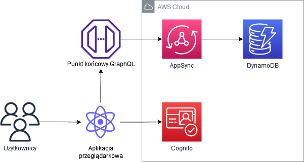
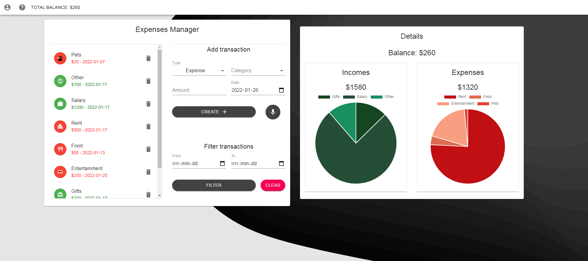
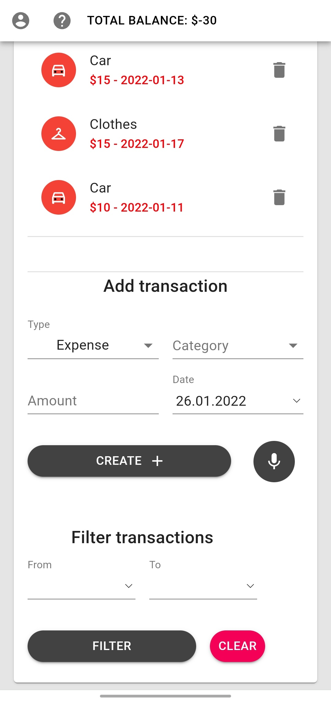

# Expenses management application

This is a simple expenses management application. It allows the user to enter and keep track of their expenses, as well as sort it by type and date. It also uses voice recognition, allowing the user to add expenses and incomes using their voice. This app has a clean and intuitive Material UI interface making it easy to add and track expenses. The UI for mobile and tablet devices has been rescaled using MUI <Grid> compontents.

## Technology Stack

JavaScript/HTML/CSS  
React  
AWS Amplify (Hosting, Cognito, DynamoDB, AppSync)  
GraphQL  
Web Speech API  
Material UI 

## Desktop main screen

## Mobile main screen

